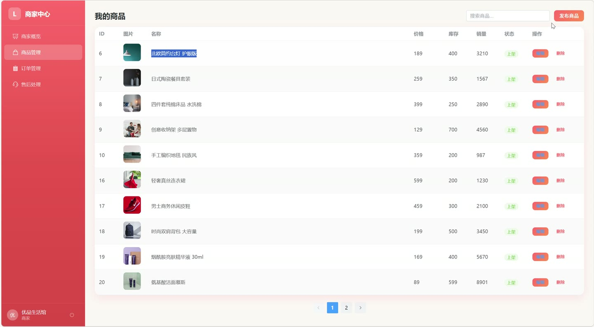
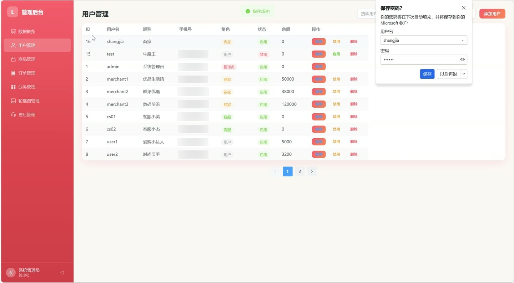
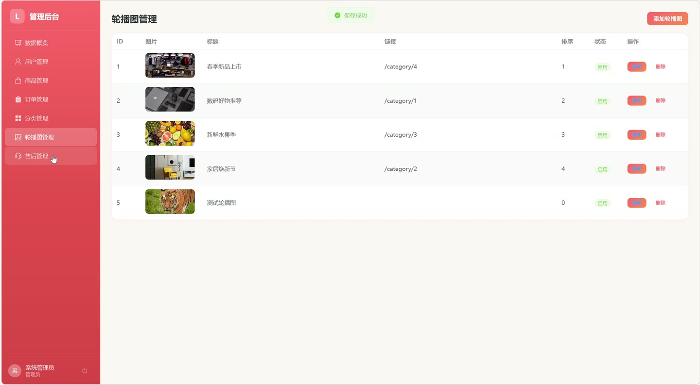

# (附文档)Springboot3+Vue3+MySQL 生活网购平台

**技术栈**：Springboot3、Vue3、MySQL

### 系统简介

本系统是一款基于 SpringBoot3 + Vue3 + MySQL 的前后端分离生活网购平台，支持普通用户、商家、管理员、客服四种角色。系统涵盖商品浏览、购物车、订单交易、售后服务、在线客服、个性化推荐等完整电商闭环，并配备商家管理后台与平台运营后台，适用于多商家入驻的 B2B2C 购物场景。
 
### 核心功能
 
### 普通用户端

 
- 注册登录：支持用户名密码注册登录，密码 MD5 加密存储，登录后签发 JWT Token 用于身份认证 
- 商品浏览：支持按分类筛选、关键词搜索商品，商品列表分页展示，展示商品名称、价格、图片、销量、评分、商家名称 
- 商品详情：查看商品完整信息（价格、库存、销量、评分、所属商家），查看商品评价列表（含用户昵称、头像、评分、评价内容、时间） 
- 热门/新品推荐：首页展示热销商品榜（按销量降序）与最新上架商品（按创建时间降序） 
- 个性化推荐：基于用户浏览、加购、收藏、购买、评分行为构建用户-商品评分矩阵，采用余弦相似度协同过滤算法推荐商品 
- 购物车管理：将商品加入购物车（支持修改数量、勾选状态），查看购物车列表（含商品详情与商家名称），删除单项或清空购物车 
- 下单结算：从购物车选择商品提交订单，填写收货人、电话、地址、备注，系统按商家自动拆分订单，校验库存并扣减库存、增加销量 
- 订单支付：对待支付订单执行支付操作，选择支付方式，记录支付时间，支付后订单进入待发货状态 
- 确认收货：对已发货订单执行确认收货，订单状态更新为已完成并记录完成时间 
- 取消订单：对待支付订单执行取消操作，自动回补商品库存并扣减销量 
- 订单列表：按状态筛选订单（待支付/待发货/待收货/已完成/已取消/售后中），展示订单商品明细、商家名称、支付金额，标注已评价商品 
- 商品评价：对已购买商品发表评分（1-5星）与评价内容，系统自动更新商品平均评分 
- 收藏商品：对感兴趣的商品添加/取消收藏，收藏列表分页展示商品信息，收藏行为计入推荐算法权重 
- 收货地址管理：新增、编辑、删除收货地址，支持设置默认地址，默认地址排序优先 
- 申请售后：对订单发起售后申请，填写售后类型、原因、描述、图片，提交后订单状态自动变为售后中 
- 售后进度查看：查看自己发起的售后申请列表（含订单信息、商品明细、处理状态），查看售后处理结果 
- 在线客服：发起客服会话（自动分配在线客服），查看会话列表（含对方昵称、角色、未读消息数），发送/接收消息，标记消息已读 
- 个人资料管理：修改昵称、头像、手机号、邮箱等个人信息 
- 修改密码：验证原密码后设置新密码，密码 MD5 加密存储
 
### 商家端

 
- 商家看板：统计当前商家的商品数、订单数、售后数、已完成订单总营收 
- 商品管理：查看本商家商品列表（支持关键词搜索），新增商品（设置名称、分类、价格、库存、图片、描述等），编辑商品信息，删除商品 
- 订单管理：查看本商家订单列表（按状态筛选），查看订单详情（含收货信息、商品明细、买家评价），对待发货订单执行发货操作（记录发货时间） 
- 售后处理：查看本商家收到的售后申请列表（含买家昵称、订单号、商品明细），查看售后详情
 
### 管理员端

 
- 数据看板：统计平台用户总数、商品总数、订单总数、售后申请总数 
- 用户管理：分页查看用户列表（支持按用户名/昵称/手机号关键词搜索、按角色筛选），新增用户，编辑用户信息（含重置密码），删除用户，启用/禁用用户账号 
- 商品管理：查看平台全部商品列表（支持关键词搜索、按分类筛选），编辑商品信息（含上下架状态），删除违规商品 
- 订单管理：查看平台全部订单（按状态筛选、按订单号搜索），查看任意订单详情（含商品明细、买家信息、商家信息） 
- 分类管理：新增、编辑、删除商品分类，分类按排序值展示 
- 轮播图管理：新增、编辑、删除首页轮播图，设置标题、图片、链接、排序值、启用状态 
- 售后管理：查看平台全部售后申请（按状态筛选），处理售后申请（填写处理结果、设置状态）
 
### 客服端

 
- 会话列表：查看与用户的所有客服会话（按售后单聚合），显示对方昵称、角色、最后一条消息、未读消息数 
- 消息收发：查看会话内全部聊天记录（含发送者昵称与角色），回复用户消息 
- 未读提醒：获取当前客服的未读消息总数，标记会话消息为已读
 
### 技术栈

 后端框架SpringBoot 3 ORMMyBatis-Plus 权限认证JWT（jjwt） 前端框架Vue 3 状态管理Pinia 构建工具Vite 数据库MySQL 工具库Hutool（MD5加密）
 
### 交付内容

 
- 后端完整源码 
- 前端完整源码 
- 数据库初始化脚本 
- 万字文档

## 界面展示

---

## 获取完整源码 + 万字文档

本仓库为项目介绍页。**完整前后端源码、数据库初始化脚本、万字项目文档**，请加微信 `kangkangcode`，或访问 [codekk.top](http://codekk.top) 获取。

可作课程设计 / 毕业设计参考，支持远程部署调试。